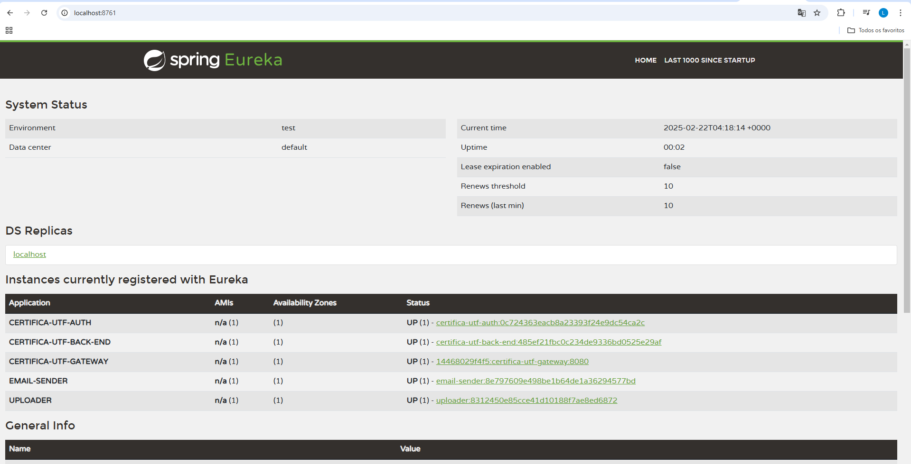

# CertificaUTF Registry

This service is reponsible by identify microservices. For more details read [service registration and discovery]( https://spring.io/guides/gs/service-registration-and-discovery)

- The microservices can call each other by name, example <b>CERTIFICA_UTF_BACK_END<b>

- Example of discovery 

